# Repository Architecture 🏗️

This document visualizes how the different components of the Autonomous Chess Repo interact to create a self-sustaining, self-healing system.

## The Autonomous Cycle
The repository operates in a continuous loop, triggered by GitHub's infrastructure and governed by strict mathematical rules.

```mermaid
graph TD
    A["⏰ GitHub Cron (15m)"] --> B["🛠️ health_check.py"]
    B -->|Verified| C["♟️ play_move.py"]
    B -->|Healed| C
    
    subgraph "Core Move Logic"
        C --> D["🔍 State Validation"]
        D --> E["🎲 Random Selection"]
        E --> F["✅ Move Execution"]
    end
    
    F --> G["📝 Atomic Update: board_state.json"]
    F --> H["📖 Atomic Update: moves_log.md"]
    F --> I["🖼️ README Status Update"]
    
    G --> J["🚀 Git Commit & Push"]
    H --> J
    I --> J
    
    J -->|Failure Event| K["⚠️ Auto-Issue Creation"]
    J -->|Success| A
```

## Safety Layer Breakdown

| Layer | Responsibility | Tooling |
| :--- | :--- | :--- |
| **Integrity** | Ensures files like JSON/MD actually exist. | `health_check.py` |
| **Validity** | Mathematically verifies FEN notation is legal. | `python-chess` FEN Validator |
| **Logic** | Enforces chess rules (no illegal moves). | `python-chess` Move Engine |
| **Persistence** | Guarantees no partial data writes. | Atomic Temporary Suffixing |
| **Reporting** | Alerts human only on critical system events. | GitHub Issues API |

## Visibility Map
- **[README.md](README.md)**: The "Live Feed" showing the latest position.
- **[moves_log.md](moves_log.md)**: The "Diary" showing the reverse-chronological history.
- **[principles.md](principles.md)**: The "Ruleset" explaining the why.
